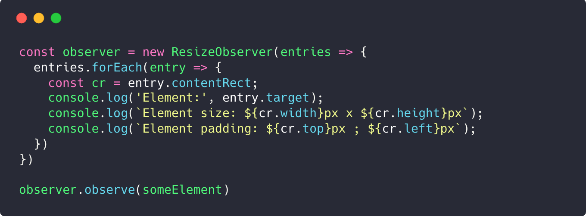

# Making responsive Vue components with ResizeObserver




Hello guys! Today I want to share a little but very useful thing.

On my current project, I have a lot of reusable components (I named it “widgets”) that can be placed anywhere. And I ran into a problem with responsive design.

Finally, I understood that css @media queries are absolutely unusable in my case.


## So, what’s the problem?

Imagine that we have some PostsItem component. We have PostsPage with list of posts:


Just a few lines of CSS, right?

```css
.post__item {
  display: flex;
}

.post__image {
  flex: 0 0 200px;
  height: 200px;
}
```

And, we also want to keep mobile view OK. It may look like:


You can say “easy”, `@media` solves this problem, right?

OK, it works. But what if we’ll use our `PostsItem` component in another place?

Oh, poor eyes. Our screen is large but we didn’t expect to see 3 posts in a row.

So, the biggest problem of `@media` queries is:

>
 Your component responsiveness is based on the screen size but should be based on its own size


But, in this case, component layout depends only on them. These components should be atomic, independently determine their own size and adapt the layout to it.

We need local responsive styles. And here comes `ResizeObserver`!


## ResizeObserver

`ResizeObserver` is a new feature that allows you to be notified when an element’s content rectangle has changed its size, and react accordingly.

Usage is stupidly simple:

```js
const observer = new ResizeObserver(entries => {
  entries.forEach(entry => {
    const cr = entry.contentRect;
    console.log('Element:', entry.target);
    console.log(`Element size: ${cr.width}px x ${cr.height}px`);
    console.log(`Element padding: ${cr.top}px ; ${cr.left}px`);
  })
})

observer.observe(someElement)
```

You can say that browser support is not OK:


But, fortunately, `ResizeObserver` has polyfill that’s based on `MutationObserver`:

## Using with Vue

I made a small `ResizeObserver` wrapper for Vue.js (also works on `Nuxt.js`) that allows you to easily deal with responsive components:

```html
<template>
  <Responsive :breakpoints="{ small: el => el.width <= 500 }">
    <div slot-scope="el" :class="['post__item', { small: el.is.small }]">
      
      <div class="post__text">{{post.text}}</div>
    </div>
  </Responsive>
</template>

<script>
  import { Responsive } from "vue-responsive-components"
  export default {
    props: ['post'],
    components: { Responsive }
  }
</script>

<style lang="scss">
.post__item {
  display: flex;
}

.post__image {
  flex: 0 0 200px;
  height: 200px;
}

.post__item.small {
  flex-direction: column;

  .post__image {
    flex: 0 auto;
    height: auto;
  }
}
</style>
```


And now it looks fine even when we put 3 posts in a row:

Now, our component is truly independent!

It also gives you opportunity to define different html markup too rather than css only. For example, I added tabs and “extra small” post view for small-sized block:

Also, I want to point that I totally removed all `@media` queries from my current project in favour of `ResizeObserver` 😉


## UPD: Bonus: `v-responsive` directive

Thanks to [this guy](https://www.reddit.com/r/vuejs/comments/8eap88/making_responsive_vue_components_with/dxtx0bu/) for an idea. I added `v-responsive` directive to get rid of wrapper component:

```html
<template>
  <!-- Will add/remove .small if the width is less / greater -->
  <div class="post__item" v-responsive="{ small: el => el.width <= 500 }">
    
    <div class="post__text">{{post.text}}</div>
  </div>
</template>

<script>
import { ResponsiveDirective } from "vue-responsive-components"
export default {
  props: ["post"],
  directives: {
    responsive: ResponsiveDirective
  }
}
</script>
```

### All links again

* [`ResizeObserver`: It’s Like document.onresize for Elements](https://developers.google.com/web/updates/2016/10/resizeobserver)
* [`ResizeObserver` polyfill](https://github.com/que-etc/resize-observer-polyfill)
* [Wrapper for Vue.js](https://github.com/Kelin2025/vue-responsive-components)

